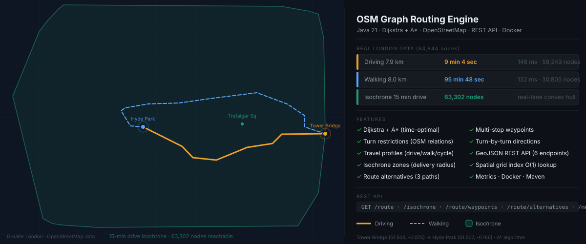

<div align="center">



# OSM Graph Routing Engine

[](https://openjdk.org/projects/jdk/21/)
[](https://maven.apache.org/)
[](https://www.docker.com/)
[](LICENSE)

</div>

A routing engine written in Java 21 that reads OpenStreetMap XML files, builds a road graph in memory, and finds shortest paths. It runs as a REST API and returns GeoJSON with turn-by-turn street directions. All benchmarks below are from real London OSM data, not a synthetic grid.

---

## Benchmark

Greater London extract, 64,844 nodes. Route: Tower Bridge to Hyde Park.

| Mode | Distance | Time | Compute | Nodes explored |
|---|---|---|---|---|
| Driving, A* | 7.89 km | 9 min 4 sec | 146 ms | 59,249 |
| Walking, A* | 8.05 km | 95 min 48 sec | 132 ms | 30,805 |
| Isochrone, 15-min drive | — | — | real-time | 63,302 reachable |

The walking route explored 48% fewer nodes. Walking mode blocks motorways and trunk roads before the algorithm runs, so A* never touches roads the profile can't use. The performance difference is a side effect of the filter, not a tuning decision.

---

## Endpoints

```
GET /route                 time-optimal route with turn-by-turn directions
GET /route/waypoints       multi-stop routing (A to B to C)
GET /route/alternatives    up to N distinct routes, roads penalized between runs
GET /isochrone             all nodes reachable within X minutes
GET /health                node and edge count
GET /metrics               total requests, average compute time
```

---

## API

### /route

```bash
curl "http://localhost:8080/route?originLat=51.5055&originLon=-0.0754\
&destLat=51.5073&destLon=-0.1657&algorithm=astar&profile=driving"
```

```json
{
  "type": "Feature",
  "geometry": {
    "type": "LineString",
    "coordinates": [[-0.096726, 51.505067], ["..."]]
  },
  "properties": {
    "distance_km": 7.892,
    "estimated_time": "9 min 4 sec",
    "algorithm": "A*",
    "compute_time_ms": 146,
    "nodes_explored": 59249,
    "path_nodes": 578,
    "directions": [
      "Follow Southwark Street for 585 m",
      "Follow Fleet Street for 470 m",
      "Follow Oxford Street for 1650 m",
      "Arrive at destination"
    ]
  }
}
```

`algorithm` accepts `astar` (default) or `dijkstra`. `profile` accepts `driving` (default), `walking`, or `cycling`.

### /route/waypoints

```bash
curl "http://localhost:8080/route/waypoints?\
waypoints=51.490,-0.180;51.510,-0.160;51.531,-0.138\
&algorithm=astar&profile=driving"
```

### /route/alternatives

```bash
curl "http://localhost:8080/route/alternatives?\
originLat=51.490&originLon=-0.180\
&destLat=51.531&destLon=-0.138\
&count=3&profile=driving"
```

Returns a GeoJSON FeatureCollection. Each alternative runs A* with edges from previous routes penalized, so you get genuinely different paths rather than tiny variations on the same one.

### /isochrone

```bash
curl "http://localhost:8080/isochrone?\
lat=51.5080&lon=-0.1281&minutes=15&profile=driving"
```

Runs Dijkstra outward from the origin and stops at the time limit. Returns a GeoJSON Polygon (convex hull of all reachable nodes). Paste the response into [geojson.io](https://geojson.io) to see it over a real map.

### /health and /metrics

```bash
curl "http://localhost:8080/health"
# {"status":"ok","nodes":64844,"edges":...}

curl "http://localhost:8080/metrics"
# {"nodes":64844,"edges":...,"total_requests":14,"avg_compute_ms":5.9}
```

---

## Quick Start

```bash
# No data needed, runs on a synthetic 15x15 grid
docker run -p 8080:8080 osm-router

# Real city data
wget -O london.osm "https://overpass-api.de/api/map?bbox=-0.20,51.48,-0.10,51.54"
docker run -p 8080:8080 -v $(pwd)/london.osm:/map.osm osm-router /map.osm --serve
```

Build from source:

```bash
mvn package
java --enable-preview -jar target/osm-routing-engine-1.0.0.jar --serve
```

---

## Travel Profiles

Each profile has its own speed table and road filter. Routing optimizes travel time, not distance, so a 3 km motorway stretch beats a 2 km residential detour for the driving profile.

| Profile | Motorway | Primary | Residential | Living street |
|---|---|---|---|---|
| driving | 120 km/h | 60 km/h | 30 km/h | 10 km/h |
| walking | blocked | 5 km/h | 5 km/h | 5 km/h |
| cycling | blocked | 15 km/h | 15 km/h | 15 km/h |

---

## Turn Restrictions

The parser does three passes over the OSM XML: nodes, then ways, then relations. On the third pass it reads `type=restriction` relations and stores each one as a `(fromNode, viaNode, toNode)` triple. Both Dijkstra and A* check that triple on every edge expansion, so `no_left_turn` and `no_u_turn` actually affect routing. On the London extract this matters, the synthetic grid has none.

```
OSM relation structure:
  member way  role="from"
  member node role="via"
  member way  role="to"
  tag k="restriction" v="no_left_turn"
```

---

## Project Structure

```
src/main/java/com/osmrouter/
├── Main.java
├── model/
│   ├── Node.java               OSM node, Haversine distance
│   ├── Edge.java               directed weighted edge
│   └── RouteResult.java        route result, GeoJSON output, directions
├── graph/
│   └── RoadGraph.java          adjacency list, spatial grid index, turn restrictions
├── parser/
│   ├── OsmParser.java          3-pass StAX XML parser
│   └── SyntheticOsmGenerator.java
├── routing/
│   ├── RoutingEngine.java      Dijkstra and A* (Strategy pattern)
│   ├── RouterService.java      coordinate snapping, directions, isochrone, alternatives
│   └── TravelProfile.java      driving/walking/cycling speed tables
└── api/
    └── RoutingApiServer.java   HTTP server, 6 endpoints, Java 21 virtual threads
```

---

## Design Notes

**Parser uses StAX, not DOM.** Full OSM planet files are over 70 GB. StAX reads one element at a time without loading the document into memory.

**Nearest-node lookup uses a spatial grid.** A linear scan across 64,844 nodes on every query would be too slow. The grid partitions space into roughly 1 km² cells so a lookup checks at most a handful of candidates.

**Routing optimizes time, not distance.** I spent a while assuming distance-optimal was the right default. It isn't. Optimizing by distance routes cars through residential streets to avoid slightly longer motorways. The fix was to weight each edge as `metres / speed_for_road_type`, which is just travel time in seconds.

**A* heuristic divides by max speed, not average.** `h(n) = straight_line_distance / max_speed` is admissible because it never overestimates. If I used average speed the heuristic would overestimate on high-speed roads and the algorithm would no longer guarantee the optimal path.

**Isochrone uses a convex hull.** After running Dijkstra outward to the time limit, I take the convex hull of all reachable nodes. It's a reasonable outer boundary and requires no external library. A concave hull would trace the actual reachable area more accurately but needs spatial software to compute correctly.

---

## Algorithms

|  | Dijkstra | A* |
|---|---|---|
| Explores | All directions equally | Guided toward destination by Haversine heuristic |
| Optimal | Always | Yes, if heuristic is admissible |
| Use case | Multi-target, small graphs | Single-target on large graphs |

---

## Tests

```bash
# No dependencies
./build.sh test

# JUnit 5
mvn test
```

Covers graph construction, spatial snapping, Dijkstra and A* correctness, path optimality, Haversine accuracy, GeoJSON output, profile filtering, and turn restriction enforcement.